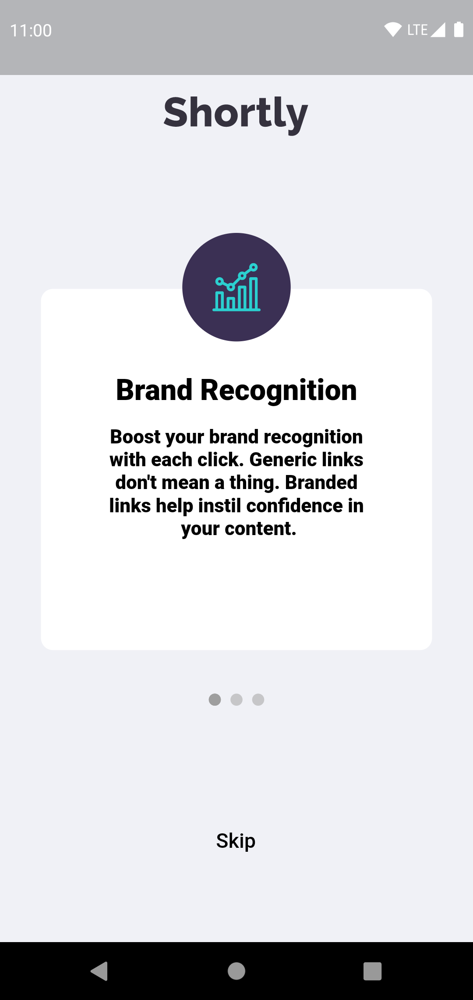
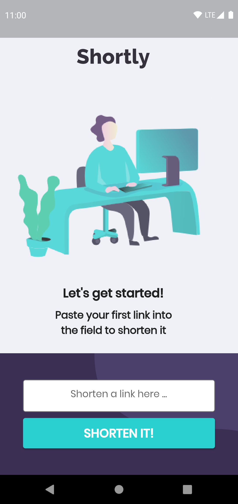
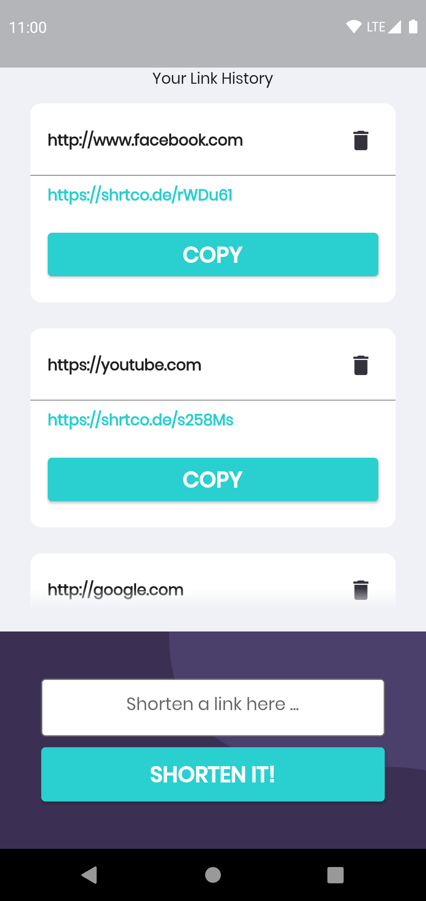

# shortly

A URL shortening Flutter app.

  
    

### Features

* On-boarding flow - first time users are greeted with a flow that shows them what they can expect
  from the app.
* Shorten it - enter any valid web URL and get a short url that can be used instead.
* Link History - see (or delete) your history of shortened links locally.

# Built with

### Architecture

The app is built with BloC and divided by feature. The layers in each feature from top to bottom:

* Data Sources - either a remote API or local storage.
* Repositories - uses the appropriate data source and parses data to appropriate form.
* Use Cases - mostly map to features and actions the app provides. good starting point to understand
  the code base.
* BloC - consumes events and exposes a stream of states to the UI. responsible for state management.
* UI - whats visible to the user.

### Tech

* Flutter 2.0.5 SDK.
* Retrofit - for API calls.
* Floor - for local database storage.
* Bloc - for state management.
* GetIt and Injectable - for DI.
* Unit Tests with Flutter Test and Mockito

------ 

### Run the app

make sure you are using Flutter 2.0.5 SDK (or prior to 2.2.0) and run the command `flutter run`

### Run the tests

`flutter test`